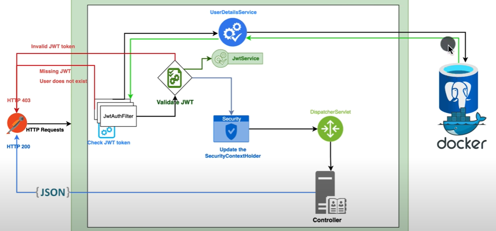
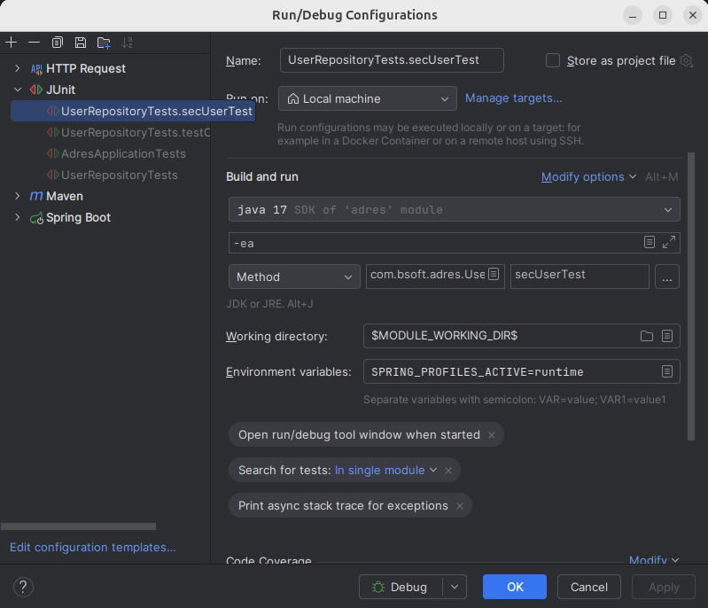

# JWT Tokens

**JWT** Json Web Token

See 
- https://www.youtube.com/watch?v=KxqlJblhzfI
- https://www.javainuse.com/boot3/sec/7
- https://jwt.io/ Tool to visualize the token

## Overview

The proces


The JWT token consists of:
- header 
  - type of token
  - algorithm for signing
- payload
  - claims
- signature used to verify the claim.

## IntelliJ testsetup with profiles

See


## Maven test run

```bash
(export SPRING_PROFILES_ACTIVE=develop && mvn clean test)
```

## Required depedencies

```xml
    <dependency>
        <groupId>io.jsonwebtoken</groupId>
        <artifactId>jjwt-api</artifactId>
        <version>0.12.3</version>
    </dependency>
    <dependency>
        <groupId>io.jsonwebtoken</groupId>
        <artifactId>jjwt-impl</artifactId>
        <version>0.12.3</version>
    </dependency>
    <dependency>
        <groupId>io.jsonwebtoken</groupId>
        <artifactId>jjwt-jackson</artifactId>
        <version>0.12.3</version>
    </dependency>
```

## Tools

- Key generator: https://allkeysgenerator.com/random ?

1:25
