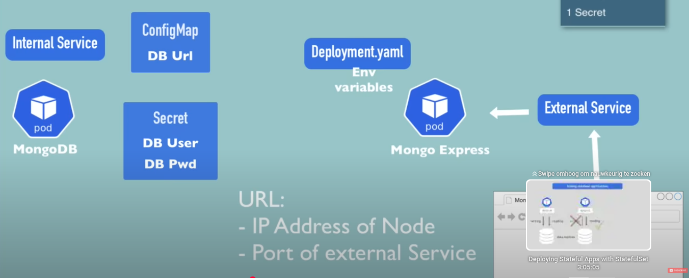
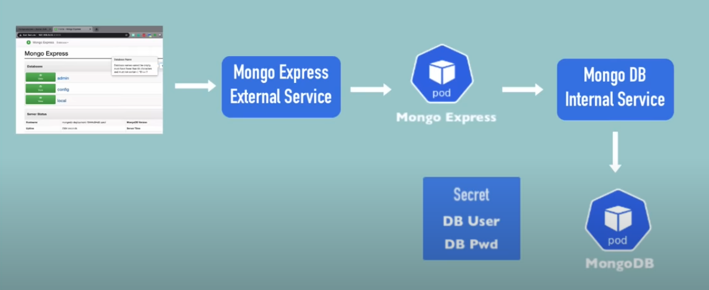

# Kubernetes

See
- https://www.youtube.com/watch?v=X48VuDVv0do

2:01:00 https://youtu.be/X48VuDVv0do?feature=shared&t=7313

## Intro
Kubernetes is an open source container orchestration tool.

Developed by Google

Kubernetes helps to manage containerized applications in different envirnoments (physical, virtual, cloud)

Trend monolith -> microservices, need for container management

Kubernetes offers:
- high availability
- scalability
- disaster recovery

Kubernetes components:
- node a physical or virtual machine
- a virtual network
- pod smallest unit of kubernetes
  - an abstraction of a container
  - a layer on top of the container
  - an abstraction of the container
  - usually only 1 container in each pod
  - each pod is efameral, meaning a pod can die at any time. A new one will be created in its place by kubernetes with a new ip adres. 
  - each pod has an ip adress
- service a permanent ip adres connected to 1..n pods
  - the lifecycle of service and pod are not connected
  - a service can be internal or external
  - external service http://128.34.24.1 which is not wat you want
  - load balancer to switch between 1..n available pod's
- ingres expose services to outside world
  - instead of service adres http://128.34.24.1 this would become https://my-app.com
  - ingres forwards to the service
- configmap external configuration of the application
- secret contains critical configuration data such as username/password for a resource.
  - storage of data in base64 encoded format
- volumes
  - attach physical storage to the pod (local or remote to the node where the pod is active)
- deployment
  - blueprint for pod's
  - specify number of pod replica's
  - an abstraction of pod's
  - make scale up/down possible
- statefull set
  - usefull for components which have state (such as a database)
  - database read/writes are synchronized so database inconsistencies do not occur
  - not easy!!!!

### Configuration
Configuration of f.i. a database is usually part of the container image containing the database.
If this is the case, change of required resource means rebuilding the container image, push to repo and pull into pod.
Part of the configuration can also be credentials for a resource (database). These are placed in the secret component.

### Storage
Normally data stored in a pod will be gone when the pod crashes. For a database that is not usefull.
In kubernetes on uses a volume to persist data outside the context of a pod. Think of storage as an external harddrive.
The kubernetes does not manage any persistant data.
Databases can't be replicated by deployment since a database has a state.
Best practice host databases outside the kubernetes cluster.

### Disaster recovery
In order to be resilliant and have no downtime when a pod crashes, the configuration is replicated connected by the same service.
Define replica's in deployments. If one of the replicated nodes crashes, service still continues.

## Kubernetes Architecture
One of the main components of the kubernetes architecture are worker server or nodes. Each node has multiple pod's with containers.
On every node 3 processes must be installed. The are used to schedule and manage the pods. Nodes are the actual components that do the work.
- container runtime
- kubelet to schedule the pods. It interacts with containers and nodes. Kubelet starts the pod with a container inside.
- kubeproxy to forward request to a pod
  - contains logic to optimeze forwarding requests

Interaction with the cluster is done by master processes on a master node which:
- schedule pods
- monitor pods
- reschedule/re-start pods
- join new nodes

Master node has different processes compaired to worker nodes.
- api server, acts as 
  - a cluster gateway. Usages kubernetes dashboard, cli kubectl
  - a gatekeeper for authentication
- scheduler
  - schedules new pod's on one of the worker nodes, has logic to determine which worker node to use. Uses available/desired resources of worker nodes/pod.
- controller manager
  - detect pods/nodes die and take action. Detects state changes, uses scheduler to re-start pods.
- etcd, key value store of the cluster. Cluster brain.
  - resources on each worker node
  - state of pods
  - cluster health
In practice the master node is replicated and load balanced

Master nodes are more important for controlling the kubernetes cluster bu need less resources (cpu, ram, storage) than worker nodes.


## Minikube
Minikube is a local lightweight kubernetes environment with on one node master and worker processes for kubernetes.
- creates virtual box on your machine
- one node runs in the virtual box
- one node contains the kubernetes cluster
- for testing purpose

## Kubectl
A client to interact with the kubernetes cluster using the api server.
Kubectl can interact with each kubernetes cluster.

# Workshop
Install hybervisor (KVM on ubuntu 24.04), minikube and kubectl. See [Actual installation of KVM](#actual-installation-of-kvm)
```bash
minikube start --driver=kvm2

minikube status
minikube
type: Control Plane
host: Running
kubelet: Running
apiserver: Running
kubeconfig: Configured

kubectl version
Client Version: v1.31.0
Kustomize Version: v5.4.2
Server Version: v1.32.0

```
## Kubectl

**Status of k8s components**
- kubectl get nodes | pod | services | replicaset | deployment

```bash
kubectl get nodes
NAME       STATUS   ROLES           AGE   VERSION
minikube   Ready    control-plane   11m   v1.32.0

kubectl get pod
No resources found in default namespace.

kubectl get services
NAME         TYPE        CLUSTER-IP   EXTERNAL-IP   PORT(S)   AGE
kubernetes   ClusterIP   10.96.0.1    <none>        443/TCP   27m
```
**CRUD commands**
- create deployment: kubectl create deployment <name>
- edit deployment:   kubectl edit deployment <name>
- delete deployment: kubectl delete deployment <name>

```bash
# Create pod
# Pod is smallest unit of kubernetes which cannot be created.
# Instead a deployment which describes the pod is created
# usage: kubectl create deployment <name> --image=<imagename> [--dry-run] [options]
kubectl create deployment nginx-depl --image=nginx
deployment.apps/nginx-depl created

# When creating the deployment, the deployment has the blueprint for the pod. 
# The blueprint is the minimalistic configuration for the pod. 
# Only name and image are required. Rest of parameters are defaults

kubectl get deployment
NAME         READY   UP-TO-DATE   AVAILABLE   AGE
nginx-depl   1/1     1            1           40s

kubectl get pod
NAME                          READY   STATUS    RESTARTS   AGE
nginx-depl-68c944fcbc-82vtm   1/1     Running   0          4m16s

# Replicaset is a component between deployment and pod
kubectl get replicaset
NAME                    DESIRED   CURRENT   READY   AGE
nginx-depl-68c944fcbc   1         1         1       10m

kubectl edit deployment nginx-depl
# Opens editor (vi) with autogenerated defaults


# Please edit the object below. Lines beginning with a '#' will be ignored,
# and an empty file will abort the edit. If an error occurs while saving this file will be
# reopened with the relevant failures.
#
`apiVersion: apps/v1
kind: Deployment
metadata:
  annotations:
    deployment.kubernetes.io/revision: "1"
  creationTimestamp: "2025-04-02T06:45:33Z"
  generation: 1
  labels:
    app: nginx-depl
  name: nginx-depl
  namespace: default
  resourceVersion: "1936"
  uid: 81dc9fd6-2219-49ee-80a9-8b1383c610a6
spec:
  progressDeadlineSeconds: 600
  replicas: 1
  revisionHistoryLimit: 10
  selector:
    matchLabels:
      app: nginx-depl
  strategy:
    rollingUpdate:
      maxSurge: 25%
      maxUnavailable: 25%
    type: RollingUpdate
  template:
    metadata:
      creationTimestamp: null
      labels:
        app: nginx-depl
    spec:
      containers:
      - image: nginx
        imagePullPolicy: Always
        name: nginx
        resources: {}
        terminationMessagePath: /dev/termination-log
        terminationMessagePolicy: File
      dnsPolicy: ClusterFirst
      restartPolicy: Always
      schedulerName: default-scheduler
      securityContext: {}
      terminationGracePeriodSeconds: 30
status:
  availableReplicas: 1
  conditions:
  - lastTransitionTime: "2025-04-02T06:45:47Z"
    lastUpdateTime: "2025-04-02T06:45:47Z"
    message: Deployment has minimum availability.
    reason: MinimumReplicasAvailable
    status: "True"
    type: Available
  - lastTransitionTime: "2025-04-02T06:45:33Z"
    lastUpdateTime: "2025-04-02T06:45:47Z"
    message: ReplicaSet "nginx-depl-68c944fcbc" has successfully progressed.
    reason: NewReplicaSetAvailable
    status: "True"
    type: Progressing
  observedGeneration: 1
  readyReplicas: 1
  replicas: 1
  updatedReplicas: 1`

# After changing the version of the image nginx to nginx:1.26.3
# The old pod (see above for the name) is stopped and replaced by the new pod with a new name.  
kubectl get pod
NAME                          READY   STATUS    RESTARTS   AGE
nginx-depl-5c7559999c-8jqh4   1/1     Running   0          20s
  
```

**Debugging pods**
- log to console:        kubectl logs <pod name>
- get internal terminal: kubectl exec -it <pod name> -- bin/bash

```bash
kubectl get pods
NAME                          READY   STATUS    RESTARTS   AGE
nginx-depl-5c7559999c-8jqh4   1/1     Running   0          5m23s

kubectl logs nginx-depl-5c7559999c-8jqh4
/docker-entrypoint.sh: /docker-entrypoint.d/ is not empty, will attempt to perform configuration
/docker-entrypoint.sh: Looking for shell scripts in /docker-entrypoint.d/
/docker-entrypoint.sh: Launching /docker-entrypoint.d/10-listen-on-ipv6-by-default.sh
10-listen-on-ipv6-by-default.sh: info: Getting the checksum of /etc/nginx/conf.d/default.conf
10-listen-on-ipv6-by-default.sh: info: Enabled listen on IPv6 in /etc/nginx/conf.d/default.conf
/docker-entrypoint.sh: Sourcing /docker-entrypoint.d/15-local-resolvers.envsh
/docker-entrypoint.sh: Launching /docker-entrypoint.d/20-envsubst-on-templates.sh
/docker-entrypoint.sh: Launching /docker-entrypoint.d/30-tune-worker-processes.sh
/docker-entrypoint.sh: Configuration complete; ready for start up
2025/04/02 18:23:54 [notice] 1#1: using the "epoll" event method
2025/04/02 18:23:54 [notice] 1#1: nginx/1.26.3
2025/04/02 18:23:54 [notice] 1#1: built by gcc 12.2.0 (Debian 12.2.0-14) 
2025/04/02 18:23:54 [notice] 1#1: OS: Linux 5.10.207
2025/04/02 18:23:54 [notice] 1#1: getrlimit(RLIMIT_NOFILE): 1048576:1048576
2025/04/02 18:23:54 [notice] 1#1: start worker processes
2025/04/02 18:23:54 [notice] 1#1: start worker process 29
2025/04/02 18:23:54 [notice] 1#1: start worker process 30

# create pod which will log something
kubectl create deployment mongo-depl --image=mongo
deployment.apps/mongo-depl created


kubectl get pod
NAME                          READY   STATUS              RESTARTS   AGE
mongo-depl-85ffbc9879-fkrlh   0/1     ContainerCreating   0          26s
nginx-depl-5c7559999c-8jqh4   1/1     Running             0          8m18s

# Show logging of the pod
kubectl logs mongo-depl-85ffbc9879-fkrlh
{"t":{"$date":"2025-04-02T18:32:05.936+00:00"},"s":"I",  "c":"CONTROL",  "id":23285,   "ctx":"main","msg":"Automatically disabling TLS 1.0, to force-enable TLS 1.0 specify --sslDisabledProtocols 'none'"}
{"t":{"$date":"2025-04-02T18:32:05.936+00:00"},"s":"I",  "c":"CONTROL",  "id":5945603, "ctx":"main","msg":"Multi threading initialized"}
{"t":{"$date":"2025-04-02T18:32:05.936+00:00"},"s":"I",  "c":"NETWORK",  "id":4648601, "ctx":"main","msg":"Implicit TCP FastOpen unavailable. If TCP FastOpen is required, set at least one of the related parameters","attr":{"relatedParameters":["tcpFastOpenServer","tcpFastOpenClient","tcpFastOpenQueueSize"]}}
{"t":{"$date":"2025-04-02T18:32:05.937+00:00"},"s":"I",  "c":"NETWORK",  "id":4915701, "ctx":"main","msg":"Initialized wire specification","attr":{"spec":{"incomingExternalClient":{"minWireVersion":0,"maxWireVersion":25},"incomingInternalClient":{"minWireVersion":0,"maxWireVersion":25},"outgoing":{"minWireVersion":6,"maxWireVersion":25},"isInternalClient":true}}}

# Describe the content of the pod
kubectl describe pod mongo-depl-85ffbc9879-fkrlh
Name:             mongo-depl-85ffbc9879-fkrlh
Namespace:        default
Priority:         0
Service Account:  default
Node:             minikube/192.168.39.87
Start Time:       Wed, 02 Apr 2025 20:31:39 +0200
Labels:           app=mongo-depl
                  pod-template-hash=85ffbc9879
Annotations:      <none>
Status:           Running
IP:               10.244.0.7
IPs:
  IP:           10.244.0.7
Controlled By:  ReplicaSet/mongo-depl-85ffbc9879
Containers:
  mongo:
    Container ID:   docker://30722d0b72c78415769e0c7309080fa88b3a1717a6b7c0a85ec5c18af71a70ce
    Image:          mongo
    Image ID:       docker-pullable://mongo@sha256:1cb283500219e8fc0b61b328ea5a199a395a753d88b17351c58874fb425223cb
    Port:           <none>
    Host Port:      <none>
    State:          Running
      Started:      Wed, 02 Apr 2025 20:32:05 +0200
    Ready:          True
    Restart Count:  0
    Environment:    <none>
    Mounts:
      /var/run/secrets/kubernetes.io/serviceaccount from kube-api-access-hwltz (ro)
Conditions:
  Type                        Status
  PodReadyToStartContainers   True 
  Initialized                 True 
  Ready                       True 
  ContainersReady             True 
  PodScheduled                True 
Volumes:
  kube-api-access-hwltz:
    Type:                    Projected (a volume that contains injected data from multiple sources)
    TokenExpirationSeconds:  3607
    ConfigMapName:           kube-root-ca.crt
    ConfigMapOptional:       <nil>
    DownwardAPI:             true
QoS Class:                   BestEffort
Node-Selectors:              <none>
Tolerations:                 node.kubernetes.io/not-ready:NoExecute op=Exists for 300s
                             node.kubernetes.io/unreachable:NoExecute op=Exists for 300s
Events:
  Type    Reason     Age    From               Message
  ----    ------     ----   ----               -------
  Normal  Scheduled  2m38s  default-scheduler  Successfully assigned default/mongo-depl-85ffbc9879-fkrlh to minikube
  Normal  Pulling    2m39s  kubelet            Pulling image "mongo"
  Normal  Pulled     2m13s  kubelet            Successfully pulled image "mongo" in 25.632s (25.632s including waiting). Image size: 887476000 bytes.
  Normal  Created    2m13s  kubelet            Created container: mongo
  Normal  Started    2m12s  kubelet            Started container mongo

# Get terminal in pod  -it = interactive terminal
kubectl exec -it mongo-depl-85ffbc9879-fkrlh -- bin/bash
root@mongo-depl-85ffbc9879-fkrlh:/# 
root@mongo-depl-85ffbc9879-fkrlh:/# ls
bin  boot  data  dev  docker-entrypoint-initdb.d  etc  home  js-yaml.js  lib  lib64  media  mnt  opt  proc  root  run  sbin  srv  sys  tmp  usr  var
root@mongo-depl-85ffbc9879-fkrlh:/# exit
exit

# Get info
kubectl get deployment
NAME         READY   UP-TO-DATE   AVAILABLE   AGE
mongo-depl   1/1     1            1           26m
nginx-depl   1/1     1            1           12h

kubectl get pod
NAME                          READY   STATUS    RESTARTS   AGE
mongo-depl-85ffbc9879-fkrlh   1/1     Running   0          31m
nginx-depl-5c7559999c-8jqh4   1/1     Running   0          39m

# Delete deployment
kubectl delete deployment mongo-depl 
deployment.apps "mongo-depl" deleted

kubectl get deployment
NAME         READY   UP-TO-DATE   AVAILABLE   AGE
nginx-depl   1/1     1            1           12h

kubectl get pod
NAME                          READY   STATUS    RESTARTS   AGE
nginx-depl-5c7559999c-8jqh4   1/1     Running   0          41m

```

## Fine tune configuration
To finetune configuration one uses configuration files with as syntax:

kubectl apply -f <configuration file>

The format of the configuration file is in yaml.

```bash
kubectl apply -f nginx-deployment.yaml 
deployment.apps/nginx-deployment created

kubectl get pods
NAME                                READY   STATUS    RESTARTS   AGE
nginx-deployment-558d6675d6-tw7km   1/1     Running   0          4s

# After changing replicas from 1 -> 2 an extra instance is created.
# Status shows configured instead of created
#
kubectl apply -f nginx-deployment.yaml 
deployment.apps/nginx-deployment configured

kubectl get pods
NAME                                READY   STATUS    RESTARTS   AGE
nginx-deployment-558d6675d6-2tnxq   1/1     Running   0          3s
nginx-deployment-558d6675d6-tw7km   1/1     Running   0          119s

```

# K8s Configuration files
The format of the configuration files is in yaml, which is very struct on indentations. 
In order to check big file there are online resources like https://yamlchecker.com/ and https://www.yamllint.com/.

Each configuration file consists of 3 parts
- metadata
- specification, attributes of each component (kind) specification are different
- status, this is automatically added and updated by kubernetes. Because kubernetes will alway check what is the actual and the desired state. The status is updated continously. If the status does not match kubernetes tries to fix this. Kubernetes gets the status data from etcd - the cluster brain.

Useually the kubernetes configuration files are stored with the code.

In the kubernetes deployment file there is in the spec: section a template: section which is the blueprint of 
the pods using the same format with metadata and specification as the deployment configuration file. Basically
it is a configuration file in a configuration.

## Connection between components
To define connections between components one uses labels and selectors. The metadata part contains the labels, the spec part contains the selectors.

Deployment definition (minimum configuration)
```yaml
apiVersion: apps/v1
kind: Deployment
metadata:
  name: nginx-deployment
  labels:
    app: nginx         # Deployment label
spec:                  # Specification deployment
  replicas: 2          # Changed from 1 -> 2
  selector:
    matchLabels:
      app: nginx       # Selector for pod label
  template:
    metadata:
      labels:          # Pod label
        app: nginx
    spec:              # Specification pod
      containers:
        - name: nginx
          image: nginx:1.27.4
          ports:
          - containerPort: 8080
```

Service definition (minimum configuration)
```yaml
apiVersion: v1
kind: Service
metadata:
  name: nginx-service
spec:
  selector:
    app: nginx
  ports:
    - protocol: TCP
      port: 80           # External service port
      targetPort: 8080   # Forward to pod target port
```

Use deployment and service definitions
```bash
kubectl apply -f nginx-deployment.yaml 
deployment.apps/nginx-deployment configured
kubectl apply -f nginx-service.yaml 
service/nginx-service created
```

Check service
```bash
kubectl describe service nginx-service
Name:                     nginx-service
Namespace:                default
Labels:                   <none>
Annotations:              <none>
Selector:                 app=nginx
Type:                     ClusterIP
IP Family Policy:         SingleStack
IP Families:              IPv4
IP:                       10.101.250.230
IPs:                      10.101.250.230
Port:                     <unset>  80/TCP
TargetPort:               8080/TCP
Endpoints:                10.244.0.13:8080,10.244.0.14:8080
Session Affinity:         None
Internal Traffic Policy:  Cluster
Events:                   <none>

# Check IP adresses and port mapping
kubectl get pod -o wide
NAME                                READY   STATUS    RESTARTS   AGE     IP            NODE       NOMINATED NODE   READINESS GATES
nginx-deployment-7d4695759d-mzq4b   1/1     Running   0          6m48s   10.244.0.14   minikube   <none>           <none>
nginx-deployment-7d4695759d-swss4   1/1     Running   0          6m49s   10.244.0.13   minikube   <none>           <none>

# Get complete view of deployment
kubectl describe deployment nginx-deployment
Name:                   nginx-deployment
Namespace:              default
CreationTimestamp:      Wed, 02 Apr 2025 21:21:52 +0200
Labels:                 app=nginx
Annotations:            deployment.kubernetes.io/revision: 2
Selector:               app=nginx
Replicas:               2 desired | 2 updated | 2 total | 2 available | 0 unavailable
StrategyType:           RollingUpdate
MinReadySeconds:        0
RollingUpdateStrategy:  25% max unavailable, 25% max surge
Pod Template:
  Labels:  app=nginx
  Containers:
   nginx:
    Image:         nginx:1.27.4
    Port:          8080/TCP
    Host Port:     0/TCP
    Environment:   <none>
    Mounts:        <none>
  Volumes:         <none>
  Node-Selectors:  <none>
  Tolerations:     <none>
Conditions:
  Type           Status  Reason
  ----           ------  ------
  Available      True    MinimumReplicasAvailable
  Progressing    True    NewReplicaSetAvailable
OldReplicaSets:  nginx-deployment-558d6675d6 (0/0 replicas created)
NewReplicaSet:   nginx-deployment-7d4695759d (2/2 replicas created)
Events:
  Type    Reason             Age    From                   Message
  ----    ------             ----   ----                   -------
  Normal  ScalingReplicaSet  4m52s  deployment-controller  Scaled up replica set nginx-deployment-7d4695759d from 0 to 1
  Normal  ScalingReplicaSet  4m51s  deployment-controller  Scaled down replica set nginx-deployment-558d6675d6 from 2 to 1
  Normal  ScalingReplicaSet  4m51s  deployment-controller  Scaled up replica set nginx-deployment-7d4695759d from 1 to 2
  Normal  ScalingReplicaSet  4m49s  deployment-controller  Scaled down replica set nginx-deployment-558d6675d6 from 1 to 0

# Get etcd status information
kubectl get deployment nginx-deployment -o yaml
apiVersion: apps/v1
kind: Deployment
metadata:
  annotations:
    deployment.kubernetes.io/revision: "2"
    kubectl.kubernetes.io/last-applied-configuration: |
      {"apiVersion":"apps/v1","kind":"Deployment","metadata":{"annotations":{},"labels":{"app":"nginx"},"name":"nginx-deployment","namespace":"default"},"spec":{"replicas":2,"selector":{"matchLabels":{"app":"nginx"}},"template":{"metadata":{"labels":{"app":"nginx"}},"spec":{"containers":[{"image":"nginx:1.27.4","name":"nginx","ports":[{"containerPort":8080}]}]}}}}
  creationTimestamp: "2025-04-02T19:21:52Z"
  generation: 3
  labels:
    app: nginx
  name: nginx-deployment
  namespace: default
  resourceVersion: "12392"
  uid: 08364aa9-5dac-4d5e-b246-a8f7cda09468
spec:
  progressDeadlineSeconds: 600
  replicas: 2
  revisionHistoryLimit: 10
  selector:
    matchLabels:
      app: nginx
  strategy:
    rollingUpdate:
      maxSurge: 25%
      maxUnavailable: 25%
    type: RollingUpdate
  template:
    metadata:
      creationTimestamp: null
      labels:
        app: nginx
    spec:
      containers:
      - image: nginx:1.27.4
        imagePullPolicy: IfNotPresent
        name: nginx
        ports:
        - containerPort: 8080
          protocol: TCP
        resources: {}
        terminationMessagePath: /dev/termination-log
        terminationMessagePolicy: File
      dnsPolicy: ClusterFirst
      restartPolicy: Always
      schedulerName: default-scheduler
      securityContext: {}
      terminationGracePeriodSeconds: 30
status:
  availableReplicas: 2
  conditions:
  - lastTransitionTime: "2025-04-04T16:36:43Z"
    lastUpdateTime: "2025-04-04T16:36:43Z"
    message: Deployment has minimum availability.
    reason: MinimumReplicasAvailable
    status: "True"
    type: Available
  - lastTransitionTime: "2025-04-02T19:21:52Z"
    lastUpdateTime: "2025-04-04T17:35:56Z"
    message: ReplicaSet "nginx-deployment-7d4695759d" has successfully progressed.
    reason: NewReplicaSetAvailable
    status: "True"
    type: Progressing
  observedGeneration: 3
  readyReplicas: 2
  replicas: 2
  updatedReplicas: 2

# Delete resources
kubectl delete -f nginx-deployment.yaml 
deployment.apps "nginx-deployment" deleted
kubectl delete -f nginx-service.yaml 
service "nginx-service" deleted

```
# Complete deployment example
A complete example using:
- mongodb
- mongo-expres

To get this working you need:
- deployment definitions for pod of mongodb and mongo-expres
- service definitions for mongodb and mongo-expres
- a configmap with configuration settings
- a secret for authentication

Requirements
- Only internal components can use the mongodb using an internal service
- Mongo-expres uses the mongodb, so a 
  - mongodb url is needed, this is stored in a configmap
  - credentials for the database (username / password) are required, these are stored as a secret
  Using environment variables in the mongo-expres deployment definition
- Make mongo-expres accessible for a browser



The flow of a request from the browser is


Check the current content of the minikube cluster
```bash
kubectl get all
NAME                 TYPE        CLUSTER-IP   EXTERNAL-IP   PORT(S)   AGE
service/kubernetes   ClusterIP   10.96.0.1    <none>        443/TCP   2d11h
```
## Build configuration files
In https://hub.docker.com/search?q=mongo there is info on how to use the mongo image.
The default port for mongodb is 27017.
For credentials MONGO_INITDB_ROOT_USERNAME, MONGO_INITDB_ROOT_PASSWORD are used.
The credentials come from a kubernetes secret.

Create secrets
```bash
echo -n 'username' | base64
dXNlcm5hbWU=

echo -n 'password' | base64
cGFzc3dvcmQ=
```

```bash
kubectl apply -f mongo-secret.yaml
secret/mongodb-secret created

kubectl describe secret mongodb-secret
Name:         mongodb-secret
Namespace:    default
Labels:       <none>
Annotations:  <none>

Type:  Opaque

Data
====
mongo-root-password:  8 bytes
mongo-root-username:  8 bytes
```
```bash
kubectl apply -f mongo.yaml 
deployment.apps/mongodb-deployment created

kubectl get all
NAME                                      READY   STATUS    RESTARTS   AGE
pod/mongodb-deployment-6d9d7c68f6-rfmfw   1/1     Running   0          82s

NAME                 TYPE        CLUSTER-IP   EXTERNAL-IP   PORT(S)   AGE
service/kubernetes   ClusterIP   10.96.0.1    <none>        443/TCP   2d12h

NAME                                 READY   UP-TO-DATE   AVAILABLE   AGE
deployment.apps/mongodb-deployment   1/1     1            1           83s

NAME                                            DESIRED   CURRENT   READY   AGE
replicaset.apps/mongodb-deployment-6d9d7c68f6   1         1         1       82s

kubectl get deployment
NAME                 READY   UP-TO-DATE   AVAILABLE   AGE
mongodb-deployment   1/1     1            1           2m25s

kubectl get pod
NAME                                  READY   STATUS    RESTARTS   AGE
mongodb-deployment-6d9d7c68f6-rfmfw   1/1     Running   0          2m18s
```

Define the serice in mongo.yaml and activate the service
```bash
kubectl apply -f mongo.yaml 
deployment.apps/mongodb-deployment unchanged
service/mongodb-service created

kubectl get service -o wide
NAME              TYPE        CLUSTER-IP       EXTERNAL-IP   PORT(S)     AGE     SELECTOR
kubernetes        ClusterIP   10.96.0.1        <none>        443/TCP     2d12h   <none>
mongodb-service   ClusterIP   10.107.216.189   <none>        27017/TCP   105s    app=mongodb

kubectl get all | grep mongodb
pod/mongodb-deployment-6d9d7c68f6-rfmfw   1/1     Running   0          12m
service/mongodb-service   ClusterIP   10.107.216.189   <none>        27017/TCP   4m8s
deployment.apps/mongodb-deployment   1/1     1            1           12m
replicaset.apps/mongodb-deployment-6d9d7c68f6   1         1         1       12m

```

Define mongo-express service by looking at https://hub.docker.com/_/mongo-express for configuration parameters.
Target port is 8081.
Needed are:
- internal service adres ME_CONFIG_MONGODB_SERVER
- credentials
  - username ME_CONFIG_MONGODB_ADMINUSERNAME
  - pasword ME_CONFIG_MONGODB_ADMINPASSWORD

The internal service adres will be stored in a configmap. So other apps which use the mongo db can read the url there as well.

```bash
kubectl apply -f mongo-configmap.yaml 
configmap/mongodb-configmap created

kubectl apply -f mongo-express.yaml 
deployment.apps/mongo-express created

kubectl get pods
NAME                                  READY   STATUS    RESTARTS   AGE
mongo-express-5dd87b9fcf-kmwjt        1/1     Running   0          57s
mongodb-deployment-6d9d7c68f6-rfmfw   1/1     Running   0          32m

kubectl logs mongo-express-5dd87b9fcf-kmwjt
Waiting for mongo:27017...
/docker-entrypoint.sh: line 15: mongo: Try again
/docker-entrypoint.sh: line 15: /dev/tcp/mongo/27017: Invalid argument
No custom config.js found, loading config.default.js
Welcome to mongo-express 1.0.2
------------------------


Mongo Express server listening at http://0.0.0.0:8081
Server is open to allow connections from anyone (0.0.0.0)
basicAuth credentials are "admin:pass", it is recommended you change this in your config.js!

```

Define an external service

```bash
kubectl apply -f mongo-express.yaml 
deployment.apps/mongo-express unchanged
service/mongo-express-service created

kubectl get services
NAME                    TYPE           CLUSTER-IP       EXTERNAL-IP   PORT(S)          AGE
kubernetes              ClusterIP      10.96.0.1        <none>        443/TCP          2d12h
mongo-express-service   LoadBalancer   10.102.45.64     <pending>     8081:30000/TCP   37s
mongodb-service         ClusterIP      10.107.216.189   <none>        27017/TCP        31m

kubectl get service mongo-express-service -o wide
NAME                    TYPE           CLUSTER-IP     EXTERNAL-IP   PORT(S)          AGE   SELECTOR
mongo-express-service   LoadBalancer   10.102.45.64   <pending>     8081:30000/TCP   76s   app=mongo-express

# expose the external port
minikube service mongo-express-service
```

# Namespaces
A namespace can be used to organize resources. Like a virtual cluster inside a cluster.
By default, there are 4 namespaces

```bash
kubectl get namespaces
NAME              STATUS   AGE
default           Active   3d
kube-node-lease   Active   3d
kube-public       Active   3d
kube-system       Active   3d
```

- kubernetes-dashboard, not mentioned above, since dashboard as a plugin is not yet activated.
- kube-system, not for custom usage. Contains system processes, master and kubectl processes.
- kube-public, this contains public accessible data. A configmap which contains cluster information. ```kubectl cluster-info```
- kube-node-lease, holds information of hartbeats of nodes to determine availability of nodes.
- default, this is where all user defined resources end up unless one specifies a custom namespace.

Create a namespace
```bash
kubectl create namespace my-namespace
```

An other way to create namespaces is by using a configuration file like

```yaml
apiVersion: v1
kind: ConfigMap
metadata:
  name: mongodb-configmap
  namespace: my-namespace
data:
  database_url: "mongodb-service"
```

Why use namespaces?
- To organize resources in groups and have overview.
- Prevent resource name duplication of different teams or environments (test, production).
- Share common resources between resources in different namespaces. For instance logging is uses by project A and project B.
- Blue/green deployment to have multiple versions of an application active but share common resources.
- Create restricions such as access and resource limits on a namespace. Resource quota per namespace.

*Considerations for use namespaces*
- You cannot access most resources from another namespace.
  - configmaps and secrets are namespace specific. Even if the same resources are referenced in another namespace.
  - a service can be referenced in an other namespace. This is accomplished by adding the namespace after the service. Example service name mysql-service in namespace database is referenced as mysql-service.database from any other namespace than database.
  - some components are global in a cluster and don't live in a namespace. You cannot isolate them. Examples: volume, node.

**Resources and namespace**

```bash
# not bound to a namespace
kubectl api-resources --namespaced=false | sort
apiservices                                      apiregistration.k8s.io/v1         false        APIService
certificatesigningrequests          csr          certificates.k8s.io/v1            false        CertificateSigningRequest
clusterrolebindings                              rbac.authorization.k8s.io/v1      false        ClusterRoleBinding
clusterroles                                     rbac.authorization.k8s.io/v1      false        ClusterRole
componentstatuses                   cs           v1                                false        ComponentStatus
csidrivers                                       storage.k8s.io/v1                 false        CSIDriver
csinodes                                         storage.k8s.io/v1                 false        CSINode
customresourcedefinitions           crd,crds     apiextensions.k8s.io/v1           false        CustomResourceDefinition
flowschemas                                      flowcontrol.apiserver.k8s.io/v1   false        FlowSchema
ingressclasses                                   networking.k8s.io/v1              false        IngressClass
mutatingwebhookconfigurations                    admissionregistration.k8s.io/v1   false        MutatingWebhookConfiguration
NAME                                SHORTNAMES   APIVERSION                        NAMESPACED   KIND
namespaces                          ns           v1                                false        Namespace
nodes                                            metrics.k8s.io/v1beta1            false        NodeMetrics
nodes                               no           v1                                false        Node
persistentvolumes                   pv           v1                                false        PersistentVolume
priorityclasses                     pc           scheduling.k8s.io/v1              false        PriorityClass
prioritylevelconfigurations                      flowcontrol.apiserver.k8s.io/v1   false        PriorityLevelConfiguration
runtimeclasses                                   node.k8s.io/v1                    false        RuntimeClass
selfsubjectaccessreviews                         authorization.k8s.io/v1           false        SelfSubjectAccessReview
selfsubjectreviews                               authentication.k8s.io/v1          false        SelfSubjectReview
selfsubjectrulesreviews                          authorization.k8s.io/v1           false        SelfSubjectRulesReview
storageclasses                      sc           storage.k8s.io/v1                 false        StorageClass
subjectaccessreviews                             authorization.k8s.io/v1           false        SubjectAccessReview
tokenreviews                                     authentication.k8s.io/v1          false        TokenReview
validatingadmissionpolicies                      admissionregistration.k8s.io/v1   false        ValidatingAdmissionPolicy
validatingadmissionpolicybindings                admissionregistration.k8s.io/v1   false        ValidatingAdmissionPolicyBinding
validatingwebhookconfigurations                  admissionregistration.k8s.io/v1   false        ValidatingWebhookConfiguration
volumeattachments                                storage.k8s.io/v1                 false        VolumeAttachment

# bound to a namespace
kubectl api-resources --namespaced=true | sort
bindings                                 v1                             true         Binding
configmaps                  cm           v1                             true         ConfigMap
controllerrevisions                      apps/v1                        true         ControllerRevision
cronjobs                    cj           batch/v1                       true         CronJob
csistoragecapacities                     storage.k8s.io/v1              true         CSIStorageCapacity
daemonsets                  ds           apps/v1                        true         DaemonSet
deployments                 deploy       apps/v1                        true         Deployment
endpoints                   ep           v1                             true         Endpoints
endpointslices                           discovery.k8s.io/v1            true         EndpointSlice
events                      ev           events.k8s.io/v1               true         Event
events                      ev           v1                             true         Event
horizontalpodautoscalers    hpa          autoscaling/v2                 true         HorizontalPodAutoscaler
ingresses                   ing          networking.k8s.io/v1           true         Ingress
jobs                                     batch/v1                       true         Job
leases                                   coordination.k8s.io/v1         true         Lease
limitranges                 limits       v1                             true         LimitRange
localsubjectaccessreviews                authorization.k8s.io/v1        true         LocalSubjectAccessReview
NAME                        SHORTNAMES   APIVERSION                     NAMESPACED   KIND
networkpolicies             netpol       networking.k8s.io/v1           true         NetworkPolicy
persistentvolumeclaims      pvc          v1                             true         PersistentVolumeClaim
poddisruptionbudgets        pdb          policy/v1                      true         PodDisruptionBudget
pods                                     metrics.k8s.io/v1beta1         true         PodMetrics
pods                        po           v1                             true         Pod
podtemplates                             v1                             true         PodTemplate
replicasets                 rs           apps/v1                        true         ReplicaSet
replicationcontrollers      rc           v1                             true         ReplicationController
resourcequotas              quota        v1                             true         ResourceQuota
rolebindings                             rbac.authorization.k8s.io/v1   true         RoleBinding
roles                                    rbac.authorization.k8s.io/v1   true         Role
secrets                                  v1                             true         Secret
serviceaccounts             sa           v1                             true         ServiceAccount
services                    svc          v1                             true         Service
statefulsets                sts          apps/v1                        true         StatefulSet
```

# Cleanup
From any directory with kubernetes files
```bash
for i in *.yaml 
do 
  echo $i
  kubectl delete -f $i 
done
```

# Demo namespaces

```bash
kubectl apply -f mysql-configmap.yaml 
configmap/mysql-configmap created        # in the default namespace

kubectl get configmaps
NAME               DATA   AGE
kube-root-ca.crt   1      3d12h
mysql-configmap    1      25s

kubectl get configmap                    # uses the default namespace (see next command)
NAME               DATA   AGE
kube-root-ca.crt   1      3d12h
mysql-configmap    1      3m1s

kubectl get configmap -n default
NAME               DATA   AGE
kube-root-ca.crt   1      3d12h
mysql-configmap    1      3m6s

kubectl get configmap mysql-configmap -o yaml
apiVersion: v1
data:
  database_url: mysql-service.database
kind: ConfigMap
metadata:
  annotations:
    kubectl.kubernetes.io/last-applied-configuration: |
      {"apiVersion":"v1","data":{"database_url":"mysql-service.database"},"kind":"ConfigMap","metadata":{"annotations":{},"name":"mysql-configmap","namespace":"default"}}
  creationTimestamp: "2025-04-05T18:33:52Z"
  name: mysql-configmap
  namespace: default                    # the namespace for the configmap
  resourceVersion: "25422"
  uid: 8e4f822c-823d-4cb4-953d-14ed7e546661


# create namespace
kubectl create namespace my-namespace
namespace/my-namespace created

# use namespace
kubectl apply -f mysql-configmap.yaml --namespace=my-namespace
configmap/mysql-configmap created

# check namespace
kubectl get configmap mysql-configmap -o yaml -n my-namespace
apiVersion: v1
data:
  database_url: mysql-service.database
kind: ConfigMap
metadata:
  annotations:
    kubectl.kubernetes.io/last-applied-configuration: |
      {"apiVersion":"v1","data":{"database_url":"mysql-service.database"},"kind":"ConfigMap","metadata":{"annotations":{},"name":"mysql-configmap","namespace":"my-namespace"}}
  creationTimestamp: "2025-04-05T18:40:12Z"
  name: mysql-configmap
  namespace: my-namespace
  resourceVersion: "25727"
  uid: 6179bf09-ced4-4840-99d0-ac991bd345a0

```
***Best Practice***
Add namespace in the configuration file

If for instance a team uses a specific namespace, multiple commands need a post fix -n <namespace>. 
There is a tool (kubectx) which needs to be installed to do this for you.

```bash
sudo apt install kubectx
Reading package lists... Done
Building dependency tree... Done
Reading state information... Done
The following NEW packages will be installed:
  kubectx
0 upgraded, 1 newly installed, 0 to remove and 4 not upgraded.
Need to get 7,832 kB of archives.
After this operation, 34.2 MB of additional disk space will be used.
Get:1 https://esm.ubuntu.com/apps/ubuntu noble-apps-security/main amd64 kubectx amd64 0.9.5-1ubuntu0.3+esm1 [7,832 kB]
Fetched 7,832 kB in 1s (10.3 MB/s)   
Selecting previously unselected package kubectx.
(Reading database ... 204569 files and directories currently installed.)
Preparing to unpack .../kubectx_0.9.5-1ubuntu0.3+esm1_amd64.deb ...
Unpacking kubectx (0.9.5-1ubuntu0.3+esm1) ...
Setting up kubectx (0.9.5-1ubuntu0.3+esm1) ...
Processing triggers for man-db (2.12.0-4build2) ...

# kubens will show the known and current active namespaces
kubens
default              # current default namespace
kube-node-lease
kube-public
kube-system
kubernetes-dashboard
my-namespace

kubens my-namespace
✔ Active namespace is "my-namespace"

kubens
default
kube-node-lease
kube-public
kube-system
kubernetes-dashboard
my-namespace          # Current default namespace

kubectl get configmap
NAME               DATA   AGE
kube-root-ca.crt   1      13m
mysql-configmap    1      13m

kubectl get configmap -n default
NAME               DATA   AGE
kube-root-ca.crt   1      3d12h


```

# Layers of abstraction
A deployment manages replicasets
A replicaset manages pod
A pod is an abstraction of a container

# Install KVM
check virtualisation
```bash
lscpu | grep Virtualization
Virtualization:                       VT-x
# or
egrep -c '(vmx|svm)' /proc/cpuinfo
28
```

```bash
minikube start --driver=kvm2
kubectl get nodes
minikube status
kubectl version # client/server version of kubernetes
```
# Actual installation of KVM
```bash
sudo apt update
sudo apt install qemu-kvm libvirt-daemon-system libvirt-clients virt-manager bridge-utils
# qemu-kvm: Provides the KVM hypervisor.
# libvirt-daemon-system: Manages virtual machines.
# libvirt-clients: Provides tools for managing virtual machines.
# virt-manager: A graphical user interface for managing virtual machines.
# bridge-utils: Tools for configuring network bridges.

# Add user to groups kvm, libvirt
sudo adduser $USER kvm
sudo adduser $USER libvirt

# get group membership
# logout/login

# verify installation
virsh list --all
```


  


