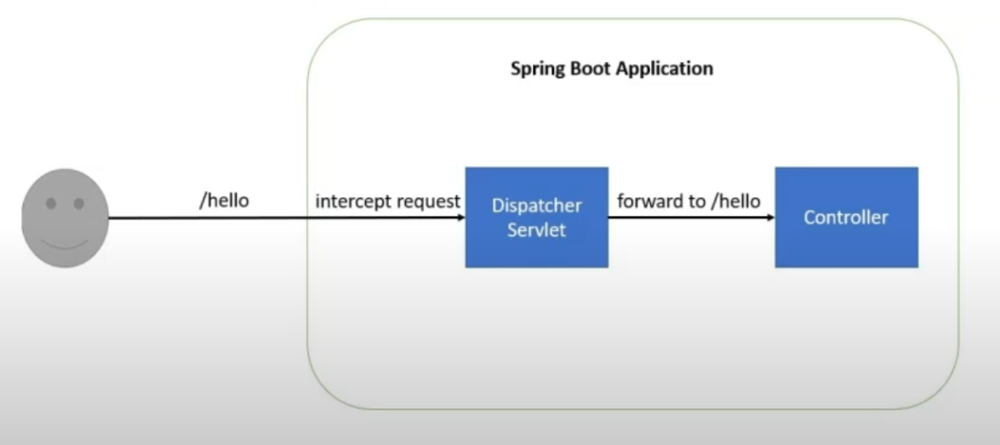

# Security

## Notes

- [Spring security tutorial](https://www.javainuse.com/boot3/sec)

The following actions are executed:

- Create project with spring web using https://start.spring.io/
- Create Restcontroller 3:00

Now the following is build:

The dispatcher servlet is forwaring the request to the designated controller.

- Add spring security by adding spring-boot-starter-security. Spring security gets enabled by default.
  a default password is generated which can be used with the default username: user.
- By default you get redirected to a /login page.

Now the security filter is executed in front of the dispatcher servlet.
The order in the filters is important.

There are three scenario's

- default login page /login
    - UsernamePasswordAuthenticatonFilter
    - DefaultLoginPageGeneratingFilter
    - AuthorizationFilter

